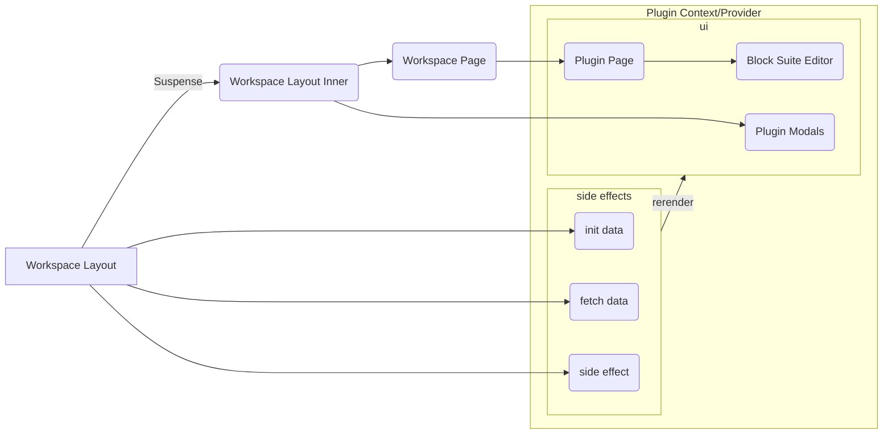

# Talking about Affine under the hood 

by Alex Yang

---
transition: slide-left
---

# Overall infrastructure


<!--
You can have `style` tag in markdown to override the style for the current page.
Learn more: https://sli.dev/guide/syntax#embedded-styles
-->

<style>
h1 {
  background-color: rgb(84, 56, 255);
  background-image: linear-gradient(45deg, #5438ff 10%, #7d91ff 20%);
  background-size: 100%;
  -webkit-background-clip: text;
  -moz-background-clip: text;
  -webkit-text-fill-color: transparent;
  -moz-text-fill-color: transparent;
}
</style>

---
transition: fade
---


# Workspace initialization

```tsx {all}
interface JotaiWorksapce {
  id: string
  flavor: 'affine' | 'local'
}
function WorkspaceLayout({ chilren }) {
  const setWorkspace = useSetAtom(jotaiWorkspace)
  useEffect(() => {
    if (isFirst) {
      WorkspacePlugins.Events['affine:first'](setWorkspace)
    }
  }, [])
  return (
    <>
      <Suspense>
        <WorkspaceLayoutInner>
          {children}
        </WorkspaceLayoutInner>
      </Suspense>
    </>
  )
}
```

---
transition: fade
---
# Workspace initialization

```tsx {all}
const worksapceAtom = atom<Promise<(LocalWorksapce | AffineWorkspace)[]>>(
  async (get) => {
    const jotaiWorkspaces = get(jotaiWorkspace)
    const worksapces = await Promise.all(jotaiWorkspaces.forEach(({ id, flavour }) => {
      return WorkspacePlugins.get(id, flavour)
    }))
    return worksapces.filter(Boolean)
})
function WorkspaceLayoutInner({ chilren }) {
  const workspaces = useAtomValue(worksapceAtom)
  const router = useRouter()
  useSyncRouterWithCurrentWorkspace(router)
  const Provider = WorkspacePlugins[currentWorkspace.flavour].Provider
  return (
    <Provider>
      <Sidebar />
      <Main>
        {children}
      </Main>
      <Midals/>
    </Provider>
  )
}
```

---
transition: slide-left
---
# Workspace initialization

```tsx {all}
// [pageId].tsx
function Page() {
  const currentWorkspace = useAtomValue(currentWorkspaceAtom)
  assertExists(page)
  const DetailPage = WorkspacePlugins[currentWorkspace.flavour].DetailPage
  return <DetailPage/>
}
Page.getLayout = (page) => <WorkspaceLayout>{page}</WorkspaceLayout>
function DetailPage() {
  const currentPageId = useAtomValue(currentPageIdAtom)
  const page = currentWorkspace.blockSuiteWorkspace.getPage(currentPageId)
  const pageMode = usePageMeta(page, 'mode')
  return (
    <>
      <Editor page={page} pageMode={pageMode}/>
    </>
  )
}
```

---
transition: slide-left
---

# Workspace workflow



---
transition: fade
---

# Yjs

```ts
import * as Y from 'yjs'

const yDoc = new Y.Doc()
const yMap = yDoc .getMap('map')
yMap.set('foo', 'goo')

const yAnotherDoc = new Y.Doc()
// how to sync the data between docs
```

---
transition: fade
---

## Provider

```ts
const createProvider = (yDoc) => {
  const fn = (update: Uint8Array) => {/* do something */ }
  return {
    connect: () => {
      // send the data to another place
      yDoc.on('update', fn)
      // receive the data from another place
      // #1: remote server
      ws.on('message', (data) => {
        Y.applyUpdate(yDoc, data)
      })
      // #2: local indexeddb
      idb.on('update', (data) => {
        Y.applyUpdate(yDoc, data)
      })
      // #3: desktop api (if we have)
      electron.listen('update', (data) => {
        Y.applyUpdate(yDoc, data)
      })
    },
    disconnect: () => {
      // cleanup side effects
    }
  }
}
```

---
transition: slide-left
---

## Provider Usage

```ts
import * as Y from 'yjs'

const yDoc = new Y.Doc()
const yMap = yDoc .getMap('map')
yMap.set('foo', 'goo')

const yAnotherDoc = new Y.Doc()
// sync the data between docs using provider
const provider1 = createProvider(yDoc)
const provider2 = createProvider(yAnotherDoc)

provider1.connect()
provider2.connect()
```

---
transition: fade
---

# Yjs + React

```tsx
const Component = () => {
  const currentWorkspace = useCurrentWorkspace()
  useEffect(() => {
    currentWorkspace.providers.forEach((provider) => {
      provider.connect()
    })
    return () => {
      currentWorkspace.providers.forEach((provider) => {
        provider.disconnect()
      })
    }
  }, [])
  // ...
}
```

---
transition: fade
---

#  Workspace loading edge cases

## Is a workspace empty?

If it's empty, we need to create initial data like 'Welcome to AFFiNE' page. (Blocking UI)

## What if user refresh the app?

We need to load the data from indexeddb or remote server. But just for once. (Background)

---
---
# Workspace Provider Types

We differ the provider into two types: `backgorund/foreground` and `necessary/unnecessary`.


