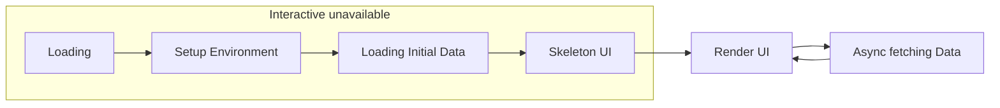
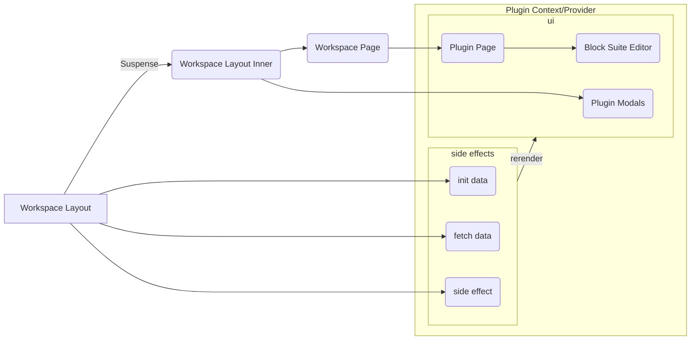

# Talking about Affine under the hood 

by Alex Yang

---
transition: slide-left
---

## AFFiNE is the next-generation collaborative knowledge base

https://affine.pro/

- (collaborative) OctoBase
- (knowledge) BlockSuite
- (base) AFFiNE

---
transition: fade
---
# Workspace Loading

- How to manage so many workspaces?

---
---
# Issue on old AFFiNE

- Care about too many things

https://github.com/toeverything/AFFiNE/blob/2dcccc772cf2f95369a8c40fe9287d0056ef7cca/packages/data-center/src/provider/base.ts#L22

- Too much encapsulation

https://github.com/toeverything/AFFiNE/blob/2dcccc772cf2f95369a8c40fe9287d0056ef7cca/packages/data-center/src/datacenter.ts#L167-L193

---
---
# Only load first workspace in first render

---
---

# Workspace initialization

```tsx {all}
interface JotaiWorksapce {
  id: string
  flavor: 'affine' | 'local'
}
function WorkspaceLayout({ chilren }) {
  const setWorkspace = useSetAtom(jotaiWorkspace)
  useEffect(() => {
    if (isFirst) {
      WorkspacePlugins.Events['affine:first'](setWorkspace)
    }
  }, [])
  return (
    <>
      <Suspense>
        <WorkspaceLayoutInner>
          {children}
        </WorkspaceLayoutInner>
      </Suspense>
    </>
  )
}
```

---
transition: fade
---
# Workspace initialization

```tsx {all}
const worksapcesAtom = atom<Promise<(LocalWorksapce | AffineWorkspace)[]>>(
  async (get) => {
    const jotaiWorkspaces = get(jotaiWorkspace)
    const worksapces = await Promise.all(jotaiWorkspaces.forEach(({ id, flavour }) => {
      return WorkspacePlugins.get(id, flavour)
    }))
    return worksapces.filter(Boolean)
})
function WorkspaceLayoutInner({ chilren }) {
  const workspaces = useAtomValue(worksapcesAtom)
  const router = useRouter()
  useSyncRouterWithCurrentWorkspace(router)
  const Provider = WorkspacePlugins[currentWorkspace.flavour].Provider
  return (
    <Provider>
      <Sidebar />
      <Main>
        {children}
      </Main>
      <Midals/>
    </Provider>
  )
}
```

---
transition: slide-left
---
# Workspace initialization

```tsx {all}
// [pageId].tsx
function Page() {
  const currentWorkspace = useAtomValue(currentWorkspaceAtom)
  assertExists(page)
  const DetailPage = WorkspacePlugins[currentWorkspace.flavour].DetailPage
  return <DetailPage/>
}
Page.getLayout = (page) => <WorkspaceLayout>{page}</WorkspaceLayout>
function DetailPage() {
  const currentPageId = useAtomValue(currentPageIdAtom)
  const page = currentWorkspace.blockSuiteWorkspace.getPage(currentPageId)
  const pageMode = usePageMeta(page, 'mode')
  return (
    <>
      <Editor page={page} pageMode={pageMode}/>
    </>
  )
}
```

---
transition: slide-left
---

# Workspace workflow



---
transition: fade
---

# Yjs

```ts
import * as Y from 'yjs'

const yDoc = new Y.Doc()
const yMap = yDoc .getMap('map')
yMap.set('foo', 'goo')

const yAnotherDoc = new Y.Doc()
// how to sync the data between docs
```

---
transition: fade
---

## Provider

```ts
const createProvider = (yDoc) => {
  const fn = (update: Uint8Array) => {/* do something */ }
  return {
    connect: () => {
      // send the data to another place
      yDoc.on('update', fn)
      // receive the data from another place
      // #1: remote server
      ws.on('message', (data) => {
        Y.applyUpdate(yDoc, data)
      })
      // #2: local indexeddb
      idb.on('update', (data) => {
        Y.applyUpdate(yDoc, data)
      })
      // #3: desktop api (if we have)
      electron.listen('update', (data) => {
        Y.applyUpdate(yDoc, data)
      })
    },
    disconnect: () => {
      // cleanup side effects
    }
  }
}
```

---
transition: slide-left
---

## Provider Usage

```ts
import * as Y from 'yjs'

const yDoc = new Y.Doc()
const yMap = yDoc .getMap('map')
yMap.set('foo', 'goo')

const yAnotherDoc = new Y.Doc()
// sync the data between docs using provider
const provider1 = createProvider(yDoc)
const provider2 = createProvider(yAnotherDoc)

provider1.connect()
provider2.connect()
```

---
transition: fade
---

# Yjs + React

```tsx
const Component = () => {
  const currentWorkspace = useCurrentWorkspace()
  useEffect(() => {
    currentWorkspace.providers.forEach((provider) => {
      provider.connect()
    })
    return () => {
      currentWorkspace.providers.forEach((provider) => {
        provider.disconnect()
      })
    }
  }, [])
  // ...
}
```

---
transition: fade
---

#  Workspace loading edge cases

## Is a workspace empty?

If it's empty, we need to create initial data like 'Welcome to AFFiNE' page. (Blocking UI)

## What if a user refreshes the app?

We need to load the data from indexeddb or remote server. But just for once. (Background)

---
---
# Workspace Provider Types

We differ the provider into two types: `backgorund/foreground` and `necessary/unnecessary`.


---
---
# Talking about the future

- Plugin System
- Separate Modules

---
---
# Plugin

## Theme?

We use CSS variables. So it's easy to change the theme.

## New Workspace?

Workspace Plugin

## New Block?

BlockSuite things

## New Feature on the Page?

AdHoc UI Plugin

---
---
# Plugin


---
---

https://github.com/DimensionDev/Maskbook/blob/develop/packages/plugins/Example/src/index.ts
https://github.com/DimensionDev/Maskbook/blob/develop/packages/plugin-infra/src/manager/store.ts

---
---
# Module

- UI
- State
- Test

---
---
# Module

```ts
const init = createModule('user', context => {
  const { fetch, requestUser } = context.store.get(
    context.atoms.resourceContextAtom
  );
  const userIdAtom = primitiveAtom<string | null>(
    requestUser?.id ?? null
  );

  const userAtom = effectAtom<FakeUser | null>(async get => {
    const id = get(userIdAtom);
    if (id === null) {
      return null;
    } else {
      const user = (await fetch(`http://localhost:3000/${id}`).then(r =>
        r.json()
      )) as FakeUser;
      resolved = true;
      return user;
    }
  });

  const changeUserAtom = dispatchAtom((get, set, id: string) => {
    set(userIdAtom, id);
  });

  return [userIdAtom, userAtom, changeUserAtom];
});
```

https://jotai.org/docs/integrations/molecules

---
---
