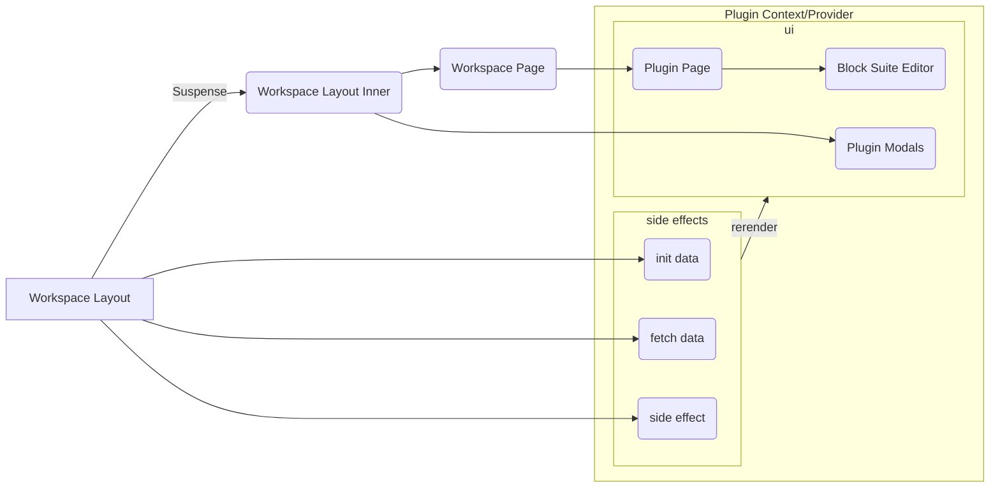

---
# try also 'default' to start simple
theme: seriph
# random image from a curated Unsplash collection by Anthony
# like them? see https://unsplash.com/collections/94734566/slidev
background: https://source.unsplash.com/collection/94734566/1920x1080
# apply any windi css classes to the current slide
class: 'text-center'
# https://sli.dev/custom/highlighters.html
highlighter: shiki
# show line numbers in code blocks
lineNumbers: false
# some information about the slides, markdown enabled
info: |
  ## Slidev Starter Template
  Presentation slides for developers.

  Learn more at [Sli.dev](https://sli.dev)
# persist drawings in exports and build
drawings:
  persist: false
# page transition
transition: slide-left
# use UnoCSS
css: unocss
---

# Talking about Affine under the hood 

---
transition: slide-left
---

# Overall infrastructure


<!--
You can have `style` tag in markdown to override the style for the current page.
Learn more: https://sli.dev/guide/syntax#embedded-styles
-->

<style>
h1 {
  background-color: rgb(84, 56, 255);
  background-image: linear-gradient(45deg, #5438ff 10%, #7d91ff 20%);
  background-size: 100%;
  -webkit-background-clip: text;
  -moz-background-clip: text;
  -webkit-text-fill-color: transparent;
  -moz-text-fill-color: transparent;
}
</style>

---
transition: fade
---


# Workspace initialization

```tsx {all}
interface JotaiWorksapce {
  id: string
  flavor: 'affine' | 'local'
}
function WorkspaceLayout({ chilren }) {
  const setWorkspace = useSetAtom(jotaiWorkspace)
  useEffect(() => {
    if (isFirst) {
      WorkspacePlugins.Events['affine:first'](setWorkspace)
    }
  }, [])
  return (
    <>
      <Suspense>
        <WorkspaceLayoutInner>
          {children}
        </WorkspaceLayoutInner>
      </Suspense>
    </>
  )
}
```

---
transition: fade
---
# Workspace initialization

```tsx {all}
const worksapceAtom = atom<Promise<(LocalWorksapce | AffineWorkspace)[]>>(
  async (get) => {
    const jotaiWorkspaces = get(jotaiWorkspace)
    const worksapces = await Promise.all(jotaiWorkspaces.forEach(({ id, flavour }) => {
      return WorkspacePlugins.get(id, flavour)
    }))
    return worksapces.filter(Boolean)
})
function WorkspaceLayoutInner({ chilren }) {
  const workspaces = useAtomValue(worksapceAtom)
  const router = useRouter()
  useSyncRouterWithCurrentWorkspace(router)
  const Provider = WorkspacePlugins[currentWorkspace.flavour].Provider
  return (
    <Provider>
      <Sidebar />
      <Main>
        {children}
      </Main>
      <Midals/>
    </Provider>
  )
}
```

---
transition: slide-left
---
# Workspace initialization

```tsx {all}
// [pageId].tsx
function Page() {
  const currentWorkspace = useAtomValue(currentWorkspaceAtom)
  assertExists(page)
  const DetailPage = WorkspacePlugins[currentWorkspace.flavour].DetailPage
  return <DetailPage/>
}
Page.getLayout = (page) => <WorkspaceLayout>{page}</WorkspaceLayout>
function DetailPage() {
  const currentPageId = useAtomValue(currentPageIdAtom)
  const page = currentWorkspace.blockSuiteWorkspace.getPage(currentPageId)
  const pageMode = usePageMeta(page, 'mode')
  return (
    <>
      <Editor page={page} pageMode={pageMode}/>
    </>
  )
}
```

---
transition: slide-left
---

# Workspace workflow


